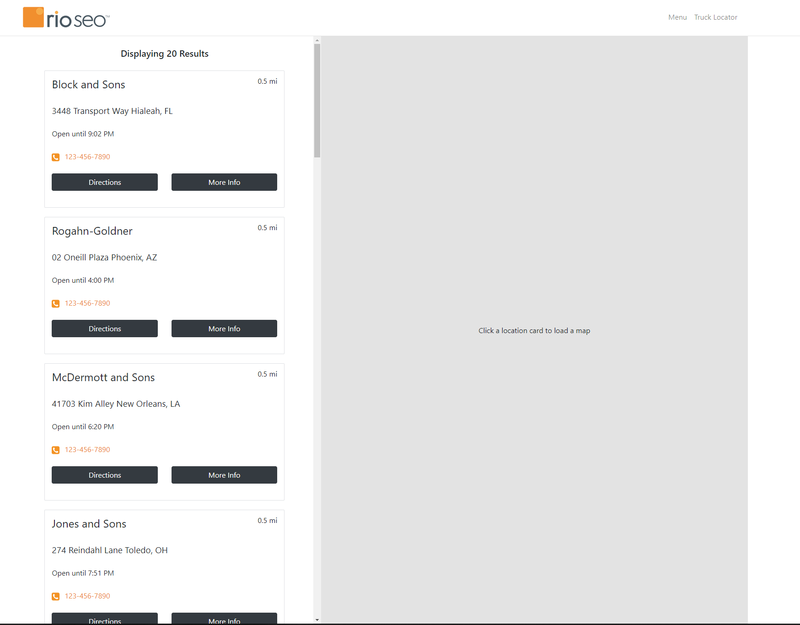

# Taco Truck Locator Code Assessment

## Technologies Used:

- [Front-End] : React, Bootstrap, JS, CSS
- [Back-End] : Node, Express
- [Dev-Tools] : Webpack, Babel

## Getting Started

** A Google API Key with Static Map & Routes enabled is required **

```
> Clone Repo
$ git clone https://github.com/kevincerda/rs-ca.git

> CD Into Directory

> Insert your Google API key inside the credentials.json file

> Install dependencies
$ npm install

> Start localhost server
$ npm start

> Build project
$ npm run build

> View localhost:3000

```

## Screenshots

### Initial load screen



### Item clicked & map render


### Details pop up


### Responsive initial load screen


### Details page


